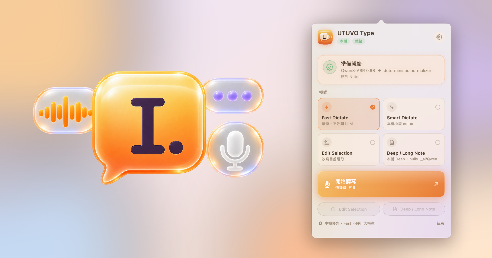

# UTUVO Type




> 全本機可用、deterministic-first 的 macOS menu bar 語音輸入 App。
> 雲端只在你自己選擇雲端 provider 並提供憑證時啟用。

🇹🇼 中文（本檔）｜[English](README.en.md)

授權：[MIT](LICENSE)。「UTUVO Type」名稱與 logo 不在 MIT 範圍內，請保留出處。

## 系統需求

| | 最低 | 建議 |
|---|---|---|
| 晶片 | **Apple Silicon**（M1 以上）——本機引擎走 MLX | Intel Mac 只能用雲端或系統內建語音 |
| macOS | 14 Sonoma | 26 以上有 Liquid Glass 介面 |
| 記憶體 | **8 GB**：Fast Dictate（Qwen3-ASR 0.6B 常駐約 1 GB） | **16 GB**：Smart／Edit 的本機 editor（Qwen3-4B 4-bit，約 3 GB）；Deep 本機 27B 需 **48 GB 以上**，否則請用雲端 |
| 磁碟 | 1.5 GB（ASR 模型＋venv） | ＋3 GB 本機 editor；＋30 GB 若要 27B |
| 其他 | Python 3.10+（`xcode-select --install` 或 `brew install python@3.12`） | 第一次安裝引擎需要網路 |

App 第一次啟動會依硬體判定建議路徑（Apple Silicon＋8 GB 以上＝完全本機；記憶體較少＝只用 Fast；Intel＝雲端），一鍵套用、隨時可改。

## 從 DMG 安裝（不需要 clone）

1. 到 [Releases](https://github.com/mickyyang-1407/utuvo-type/releases/latest) 下載 `UTUVO-Type-<版本>-macOS-arm64.dmg`（Developer ID 簽章＋Apple 公證）。
2. 拖進「應用程式」，開啟後點 menu bar 的 UTUVO Type 圖示 → 設定 → 一般 → **安裝本機引擎**。
   模型**不在 DMG 裡**：按下按鈕才會建 Python venv 並下載 Qwen3-ASR 0.6B（約 1.2 GB，一次性、可斷點續傳），
   落在 `~/Library/Application Support/UTUVO Type/engine/`。安裝前仍可用雲端模式。
3. 依提示授權麥克風與輔助使用，按 ⌥Space 開始聽寫。

## 從原始碼安裝（三步驟）

```bash
git clone <repo-url> && cd utuvo-type
./scripts/bootstrap-runtime.sh   # 建 Python venv、裝相依、下載 ASR 模型（約 1.2 GB，一次性）
./scripts/build-app.sh           # 產生並簽署 dist/UTUVO Type.app
open "dist/UTUVO Type.app"
```

> 簽名需求：`build-app.sh` 預設用 **Developer ID Application** 憑證簽名（讓 TCC 授權跨
> rebuild 存活）。沒有 Apple 開發者憑證也能跑：`UTUVO_TYPE_ALLOW_ADHOC=1 ./scripts/build-app.sh`
> 改用 adhoc 簽名（缺點：每次重建後需重新授權麥克風／輔助使用）。

UTUVO Type 是 UTUVO 小型工具系列中的語音輸入 App，package slug 仍是
`utuvo-type`。它把口述／選取內容即時整理成
可直接貼上的繁體中文文本。先在地端做確定性格式化（標點、贅詞、自修正、
數字／日期／金額、字典詞彙、清單線索），需要時再走百鍊雲端 formatter。
模型 fallback 與 27B 本機模式都受到嚴格路由策略管控。

## 里程碑

| 階段 | 內容 | 狀態 |
|---|---|---|
| M0 | SwiftPM 核心、deterministic normalizer、路由策略、30 題 benchmark、腳本 | 已完成 |
| M1 | AppKit menu bar、可設定快捷鍵、麥克風／輔助使用權限、貼上、四模式 | 已完成 |
| M2 | 百鍊 WebSocket ASR、SSE formatter、provider fallback | 已接 adapter；待真機／帳號 benchmark |
| M3 | 小型本機 editor 與本機 ASR runtime | 已完成；Qwen3-ASR 0.6B + Qwen3 4B |
| M4 | 27B 本機 Deep mode（adapter） | 已接 adapter；需手動設定 model，絕不自動下載 |

> 尚未用真實 provider 宣告 latency／模型指標；本檔不假造數字。

最近一次全面清票：**2026-09-11**——08-24 留下的 5 張票全關、iOS 鍵盤接上 core 清理／
個人字典／歷史、修掉一個「按錄音就整個 app 當掉」的 P0。詳見
[`docs/ACCEPTANCE-2026-09-11.md`](docs/ACCEPTANCE-2026-09-11.md)。
使用手冊：[macOS](docs/USER-GUIDE-macOS.md)｜[iOS](docs/USER-GUIDE-iOS.md)。

## 快速開始

```bash
./scripts/verify-scaffold.sh    # fixture、秘密衛生、Swift build/test
./scripts/run-benchmark.sh      # 跑 30 題 deterministic benchmark
./scripts/build-app.sh          # 產生 dist/UTUVO Type.app
open "dist/UTUVO Type.app"      # 啟動 menu bar App
```

目前預設是 Fast Dictate + 本機優先，不需要任何付費 API 或 API key。本機
runtime 已放在產品資料夾內；在這台開發機上，App 第一次啟動會自動填入
`runtime/utuvo-type-asr` 與 `runtime/utuvo-type-editor.py` 的獨立 executable
路徑。若把產品資料夾搬到別處，到 Settings → Local runtime 更新路徑即可：

- ASR：mlx-community/Qwen3-ASR-0.6B-6bit，由
  runtime/utuvo-type-asr 啟動 loopback server，錄音停止後完成轉錄。
- editor：mlx-community/Qwen3-4B-Instruct-2507-4bit，由
  runtime/utuvo-type-editor.py 啟動 loopback server，只在 Smart／Edit
  需要時整理文字。

第一次使用各 runtime 會載入模型，之後保持 warm；權重位於被 Git 忽略的
.models/，不會進入 repo。Fast 永遠不呼叫 editor；Smart 的短句也只用
deterministic normalizer。若本機 provider 失敗，App 仍會保留原始 transcript
並貼出 deterministic 結果。

若要重新檢查本機 runtime：

    printf '%s' '嗯我今天下午三點開會，不是三點，是四點。' | runtime/utuvo-type-editor.py
    runtime/utuvo-type-asr /path/to/audio.wav

不需要手動設定 Ollama，也不會重載或修改現有 27B。百鍊仍是可選 adapter，
但本機模式不會嘗試連線。

## 第一次使用與日常操作

1. 點擊 menu bar 的橘色 UTUVO Type 圖示。第一次會提示麥克風與輔助使用，
   並開啟 macOS「系統設定 → 隱私權與安全性」；允許後回到 App 即可使用。
   已經完成或已經嘗試過一次後，不會因為每次點開 menu bar 而重複跳原生授權提示；
   缺少的權限會留在卡片上，讓你手動開啟對應設定頁。
2. 點齒輪 →「一般」：這裡可設定 `Transcribe Shortcut`、`Push to Talk`、
   Language、Microphone、Input Channel、Mute While Recording、Audio Feedback
   與 Output Device。輸入端點與聲道會在下一次錄音套用。
3. 點擊一般頁的快捷鍵欄位，直接按下 F13、F1–F20、字母或數字即可重新設定；
   清空後也能重新錄製。高位功能鍵同時有 Carbon、NSEvent 與
   CGEvent tap fallback。
4. 在「個人字典」分頁用「新增詞彙」加入專有名詞，不需要編輯 JSON。
5. `History` 可播放、複製、加星、重試、刪除與開啟錄音資料夾；`Models` 顯示
   Qwen3-ASR 0.6B、本機 editor 與選配百鍊；`Advanced` 提供 overlay、Escape
   cancel、Voice Activity Detection、Clipboard／Accessibility direct 貼上、Auto
   Submit、history retention、prompt path 與每 App preset；`About` 顯示權限、
   資料與 log 路徑。Accessibility direct 失敗時會自動回到 Clipboard，不遺失文字。

預設為 Fast Dictate + 本機模式：普通短句不呼叫大型模型、不需要 API key。
目前 App 的顯示名稱是 **UTUVO Type**，橘色 accent 為 `#F97316`；產品程式碼
與資料夾仍固定在 `utuvo-type/`。

百鍊模式的 key 只從 macOS Keychain（service `com.utuvo.type.bailian`）或
`UTUVO_TYPE_BAILIAN_API_KEY`／`DASHSCOPE_API_KEY` 讀取。App 不在 UI、log、
fixture 或 Git 顯示 key。

## 隱私與安全備註

- 完全本機模式下，音訊不離機、無遙測；細節見 `PRIVACY.md` 與 `docs/SETUP.md`。
- CLI relay（`utuvo-type-cli --toggle-transcription` 等）走
  `DistributedNotificationCenter`，機器內任一進程皆可觸發白名單命令。這與
  同類工具的 CLI 同級：本機攻擊者本來就有程式執行權，且錄音時有 overlay 與
  提示音可見。開源版不做進一步加固，僅在此聲明。

## 目錄

- `Sources/UTUVOTypeCore/` — Swift 核心（normalizer、routing、prompt loader）
- `Sources/UTUVOTypeApp/` — 原生 AppKit/SwiftUI menu bar app、AudioEngine、AX、paste、provider adapters
- `Sources/UTUVOBench/` — benchmark 執行檔
- `Tests/UTUVOTypeCoreTests/` — 單元測試
- `docs/SETUP.md` — 權限、快捷鍵與密鑰邊界
- `docs/BRAND.md` — UTUVO Tiny Tools 系列與 Type logo 規則
- `prompts/` — formatter prompt 範本
- `config/` — routing / dictionary 範例（無真實金鑰）
- `benchmarks/` — 30 題 JSONL + 評估說明 + M0 報告
- `scripts/` — verify / run-benchmark / build-app

## 邊界

本 repo 只管 UTUVO Type 自己；其他 App 的設定、系統上的 Ollama 與本機模型一律不動。
詳細政策見 `PRODUCT.md` 與 `ARCHITECTURE.md`。

## 致謝

設定頁的資訊結構參考了開源的 [Handy](https://github.com/cjpais/Handy)；本機 ASR 使用 [Qwen3-ASR](https://huggingface.co/mlx-community/Qwen3-ASR-0.6B-6bit) 的 MLX 版本。
